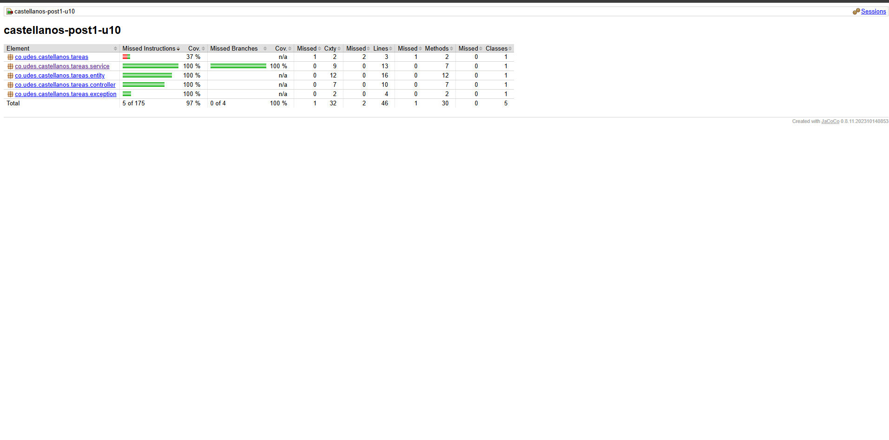
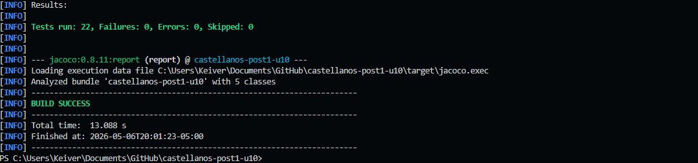

# castellanos-post1-u10

## Suite de Pruebas con JUnit 5, Mockito y JaCoCo

**Unidad 10 — Programación Web | Ingeniería de Sistemas UDES 2026**

---

## Objetivo

Implementar una suite de pruebas automatizadas sobre una aplicación Spring Boot de gestión de tareas, aplicando:

- **JUnit 5 + Mockito** para pruebas unitarias de la capa de servicio
- **@WebMvcTest** para pruebas de integración de la capa de controladores
- **@DataJpaTest** para pruebas de integración de la capa de repositorios
- **JaCoCo** para medir y verificar cobertura de código con umbral mínimo del 70%

---

## Tecnologías

| Tecnología  | Versión                                       |
| ----------- | --------------------------------------------- |
| Java        | 21.0.10                                       |
| Spring Boot | 3.2.5                                         |
| Maven       | 3.9.12                                        |
| JUnit 5     | 5.10.x (incluido en spring-boot-starter-test) |
| Mockito     | 5.x (incluido en spring-boot-starter-test)    |
| AssertJ     | 3.x (incluido en spring-boot-starter-test)    |
| H2 Database | runtime (pruebas en memoria)                  |
| JaCoCo      | 0.8.11                                        |

---

## Arquitectura del Proyecto

```
castellanos-post1-u10/
├── src/
│   ├── main/java/co/udes/castellanos/tareas/
│   │   ├── TareasApplication.java          ← Arranque Spring Boot
│   │   ├── entity/
│   │   │   └── Tarea.java                  ← Entidad JPA
│   │   ├── repository/
│   │   │   └── TareaRepository.java        ← JpaRepository + findByCompletada
│   │   ├── service/
│   │   │   └── TareaService.java           ← Lógica de negocio
│   │   ├── controller/
│   │   │   └── TareaController.java        ← REST endpoints
│   │   └── exception/
│   │       └── TareaNotFoundException.java ← Excepción de dominio
│   ├── main/resources/
│   │   └── application.properties          ← Configuración H2 en memoria
│   └── test/java/co/udes/castellanos/tareas/
│       ├── service/
│       │   └── TareaServiceTest.java       ← Checkpoint 1: Mockito
│       ├── controller/
│       │   └── TareaControllerTest.java    ← Checkpoint 2: @WebMvcTest
│       └── repository/
│           └── TareaRepositoryTest.java    ← Checkpoint 2: @DataJpaTest
├── capturas/
│   ├── jacoco-reporte-cobertura.png
│   └── tests-verde-mvn.png
└── pom.xml
```

---

## Prerrequisitos

- Java 21+
- Maven 3.9.x
- Git
- IDE con soporte Java (VS Code + Extension Pack for Java o IntelliJ IDEA)

> No se requiere MySQL ni Tomcat. La aplicación usa **H2 en memoria** tanto en desarrollo como en pruebas.

---

## Ejecución

### Ejecutar la suite de pruebas completa

```bash
mvn clean test
```

Resultado esperado:

```
Tests run: 22, Failures: 0, Errors: 0, Skipped: 0
BUILD SUCCESS
```

### Verificar cobertura con JaCoCo (≥ 70%)

```bash
mvn clean verify
```

Resultado esperado:

```
[INFO] All coverage checks have been met.
BUILD SUCCESS
```

### Ver el reporte de cobertura HTML

Abrir en el navegador:

```
target/site/jacoco/index.html
```

---

## Clases de Prueba

### Checkpoint 1 — `TareaServiceTest` (Mockito)

**Estrategia:** `@ExtendWith(MockitoExtension.class)` — prueba unitaria pura. El repositorio se reemplaza con un `@Mock` y el servicio se inyecta con `@InjectMocks`. No levanta contexto Spring.

| Test                                                    | Condición         | Resultado esperado                                             |
| ------------------------------------------------------- | ----------------- | -------------------------------------------------------------- |
| `crear_conTituloValido_guardaYRetorna`                  | Título válido     | Guarda y retorna la tarea                                      |
| `crear_conTituloVacio_lanzaIllegalArgumentException`    | Título en blanco  | Lanza `IllegalArgumentException`, `repo.save()` nunca invocado |
| `crear_conTituloNulo_lanzaIllegalArgumentException`     | Título nulo       | Lanza `IllegalArgumentException`                               |
| `buscarPorId_idExistente_retornaTarea`                  | Id existe         | Retorna la tarea correcta                                      |
| `buscarPorId_idNoExistente_lanzaTareaNotFoundException` | Id no existe      | Lanza `TareaNotFoundException`                                 |
| `completar_tareaExistente_marcaCompletadaYGuarda`       | Tarea existe      | Marca `completada=true` y persiste                             |
| `completar_idNoExistente_lanzaTareaNotFoundException`   | Id no existe      | Lanza `TareaNotFoundException`, `repo.save()` nunca invocado   |
| `listarTodas_conRegistros_retornaListaCompleta`         | Hay registros     | Retorna lista completa                                         |
| `listarPorEstado_pendientes_retornaTareasPendientes`    | Filtro pendientes | Retorna solo tareas no completadas                             |

**Total: 9 tests**

---

### Checkpoint 2a — `TareaControllerTest` (@WebMvcTest)

**Estrategia:** `@WebMvcTest(TareaController.class)` — levanta únicamente el contexto MVC (dispatcher servlet, filtros y controladores). `TareaService` se reemplaza con `@MockBean` para aislar el controlador.

| Test                                                | Endpoint                         | Condición       | HTTP esperado           |
| --------------------------------------------------- | -------------------------------- | --------------- | ----------------------- |
| `listarTodas_sinTareas_retorna200ConArrayVacio`     | `GET /api/tareas`                | Lista vacía     | 200                     |
| `buscarPorId_tareaExiste_retorna200ConTarea`        | `GET /api/tareas/1`              | Tarea existe    | 200 + JSON correcto     |
| `buscarPorId_tareaNoExiste_retorna404`              | `GET /api/tareas/99`             | Tarea no existe | 404                     |
| `crear_datosValidos_retorna201ConTareaCreada`       | `POST /api/tareas`               | Datos válidos   | 201                     |
| `crear_tituloInvalido_retorna400`                   | `POST /api/tareas`               | Título inválido | 400                     |
| `completar_tareaExiste_retorna200ConCompletadaTrue` | `PATCH /api/tareas/1/completar`  | Tarea existe    | 200 + `completada=true` |
| `completar_tareaNoExiste_retorna404`                | `PATCH /api/tareas/99/completar` | Tarea no existe | 404                     |

**Total: 7 tests**

---

### Checkpoint 2b — `TareaRepositoryTest` (@DataJpaTest)

**Estrategia:** `@DataJpaTest` — levanta un contexto JPA mínimo con H2 en memoria. `TestEntityManager` se usa para preparar datos. Los cambios se **revierten automáticamente** entre tests (rollback por defecto).

| Test                                              | Condición        | Resultado esperado               |
| ------------------------------------------------- | ---------------- | -------------------------------- |
| `findByCompletada_false_retornaUnaTareaPendiente` | Hay pendientes   | Retorna solo la tarea pendiente  |
| `findByCompletada_true_retornaUnaTareaCompletada` | Hay completadas  | Retorna solo la tarea completada |
| `findById_idExistente_retornaTareaCorrecta`       | Id existe        | `Optional` con la tarea correcta |
| `findById_idNoExistente_retornaOptionalVacio`     | Id no existe     | `Optional.empty()`               |
| `save_nuevaTarea_persisteConIdAsignado`           | Nueva tarea      | Id autogenerado no nulo          |
| `findAll_conRegistros_retornaTodasLasTareas`      | BD con registros | Lista no vacía                   |

**Total: 6 tests**

---

## Cobertura JaCoCo

### Configuración (pom.xml)

- **Plugin:** `jacoco-maven-plugin 0.8.11`
- **Goals:** `prepare-agent` → `report` (fase `test`) → `check` (fase `verify`)
- **Umbral:** ≥ 70% de líneas cubiertas (`COVEREDRATIO = 0.70`)
- **Exclusiones:** `*Application.class`, `**/entity/**`, `**/model/**`

### Resultados

| Paquete      | Cobertura instrucciones | Líneas cubiertas |
| ------------ | ----------------------- | ---------------- |
| `service`    | **100 %**               | 13 / 13          |
| `controller` | **100 %**               | 10 / 10          |
| `entity`     | **100 %**               | 16 / 16          |
| `exception`  | **100 %**               | 4 / 4            |
| **Total**    | **97 %**                | **43 / 46**      |

> El umbral mínimo del 70% se supera con **97% de cobertura de instrucciones** y **100% en los paquetes `service` y `controller`**.

### Evidencia — Reporte JaCoCo



---

## Evidencia — Tests en Verde



---

## Endpoints Disponibles

| Método | Endpoint                     | Descripción                  | HTTP      |
| ------ | ---------------------------- | ---------------------------- | --------- |
| GET    | `/api/tareas`                | Listar todas las tareas      | 200       |
| GET    | `/api/tareas/{id}`           | Buscar tarea por id          | 200 / 404 |
| POST   | `/api/tareas`                | Crear nueva tarea            | 201 / 400 |
| PATCH  | `/api/tareas/{id}/completar` | Marcar tarea como completada | 200 / 404 |

---

## Decisiones Técnicas

| Decisión                                                       | Justificación                                                                                                   |
| -------------------------------------------------------------- | --------------------------------------------------------------------------------------------------------------- |
| `TareaNotFoundException` en lugar de `EntityNotFoundException` | Excepción de dominio con semántica clara; desacopla la capa de servicio de Jakarta Persistence                  |
| `@ExceptionHandler` local en el controlador                    | Manejo de errores explícito y localizado; retorna 404 y 400 sin configuración global adicional                  |
| H2 en memoria para desarrollo y pruebas                        | Permite ejecutar `mvn test` sin base de datos externa; `@DataJpaTest` usa H2 automáticamente                    |
| `@Transactional(readOnly = true)` en lecturas                  | Optimización de rendimiento; Hibernate evita flush automático en consultas de solo lectura                      |
| Exclusión de `entity` en JaCoCo check                          | Los getters/setters son código generado sin lógica de negocio; su exclusión evita falsos negativos en el umbral |

---

## Solución de Problemas Frecuentes

**`BUILD FAILURE` con JaCoCo check:**

```bash
# Ejecutar verify en lugar de test
mvn clean verify
```

**Error de compilación con `@CreationTimestamp`:**

> Agregar `spring-boot-starter-data-jpa` al pom.xml; Hibernate está incluido ahí.

**H2 Console no disponible:**

> Verificar que `spring.h2.console.enabled=true` esté en `application.properties` y acceder a `http://localhost:8080/h2-console`.

---

## Limitaciones

- La aplicación usa H2 en memoria; los datos se pierden al reiniciar (diseño intencional para pruebas).
- No se implementó autenticación/autorización (fuera del alcance de la unidad).
- El endpoint `DELETE` no fue requerido por la guía y no está implementado.
